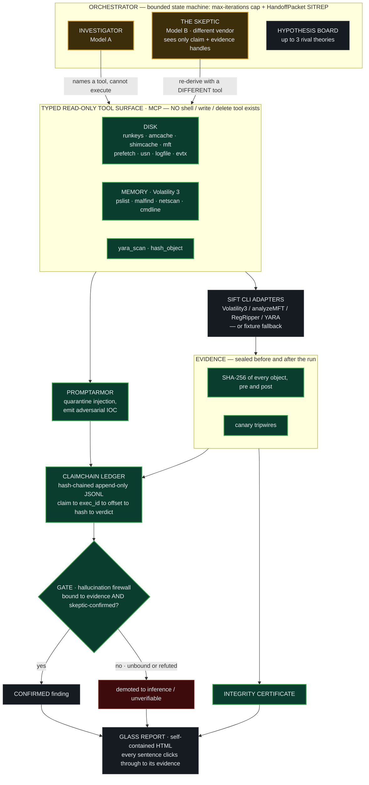

# Glass Box

**A self-correcting DFIR triage agent where trust is enforced by architecture, not prompts.**

Built for the SANS **FIND EVIL!** hackathon. Glass Box triages a Windows
disk + memory case and produces a court-grade report in which *every sentence
clicks through to the exact tool execution and artifact that produced it*.

Three properties make it trustworthy by construction:

1. **It physically cannot spoil evidence.** Its tool surface is typed and
   read-only — there is no `execute_shell` and no write/delete primitive *in
   existence*. The model cannot call what does not exist.
2. **Every finding is cryptographically bound to its evidence.** Any claim that
   can't be bound to a real tool execution is auto-demoted to "inference." A
   hash-chained ledger makes the whole run tamper-evident.
3. **An independent Skeptic re-derives every claim** with a *different* tool,
   seeing only the claim and evidence handles — never the Investigator's
   reasoning. Disagreement demotes the claim live.

Bonus: it treats **prompt injection planted in the evidence** as adversary
activity — it quarantines it as inert data and reports it as an IOC.

---

## Architecture at a glance

**Pattern:** *Custom MCP Server* (FIND EVIL! brief, Approach #2) + a multi-agent
Investigator/Skeptic loop. Full write-up — trust-boundary enforcement table
(A1–A6) and the self-correction sequence diagram — in
**[docs/ARCHITECTURE.md](docs/ARCHITECTURE.md)**.



Hard guardrails (green) hold even if the model misbehaves; the prompt guardrail
(amber) is *not* relied upon — the **gate** enforces evidence-citation
architecturally, so an unbound or skeptic-refuted claim can never be "confirmed."

---

## Quickstart (one command, zero API keys)

```bash
python run.py          # runs the reference case -> out/report.html
python run.py --open   # ...and opens the report in your browser
```

That's it. No third-party packages required — Glass Box runs on the Python 3.10+
standard library and ships a documented ground-truth case (`cases/case01`) with
parsed forensic fixtures, so the full pipeline (seal → investigate → skeptic
challenge → gate → verify → score → report) runs flawlessly on any OS.

Expected result on the reference case:

```
recall=1.0  precision=1.0  hallucinations=0  decoy_flagged=0
EVIDENCE INTACT — no spoliation detected (objects, canaries, ledger chain all OK)
1 Investigator overreach refuted by the Skeptic; 1 hypothesis killed; 1 prompt-injection IOC reported
```

Outputs land in `out/`:

| File | What it is |
|---|---|
| `report.html` | self-contained click-through report (open in any browser) |
| `ledger.jsonl` | hash-chained execution log — deliverable #8, the audit trail |
| `integrity_certificate.json` | pre/post SHA-256 + canary attestation |
| `accuracy.json` | recall / precision / hallucination count vs ground truth |

## Other entry points

```bash
make surface     # print the MCP tool surface — proves 0 write/shell tools exist
make armor       # PromptArmor injection-corpus self-test (full recall, 0 FP)
make verify      # re-verify the ledger hash chain of the last run
make test        # run the 38-test suite (stdlib unittest, no pytest needed)
```

## Run it with real, different-vendor models

Glass Box defaults to a deterministic forensic engine so the demo is
reproducible offline. To make the dual-model claim *literally* true, point the
Investigator and Skeptic at different vendors:

```bash
# Free, no credit card (this is what the SIFT demo uses): Groq Investigator + Gemini Skeptic.
# Get keys at console.groq.com and aistudio.google.com/apikey, then `cp .env.example .env`.
python run.py --investigator groq:llama-3.3-70b-versatile --skeptic gemini:gemini-2.0-flash

# Anthropic Investigator + OpenAI Skeptic
export ANTHROPIC_API_KEY=...   OPENAI_API_KEY=...
python run.py --investigator anthropic:claude-fable-5 --skeptic openai:gpt-4o

# Or fully local & offline via two different Ollama models (genuinely independent)
python run.py --investigator ollama:llama3.1 --skeptic ollama:qwen2.5
```

Providers are also auto-detected from a `.env` (see `.env.example`):
`GLASSBOX_INVESTIGATOR` / `GLASSBOX_SKEPTIC` pick the pair; supported vendors are
`groq`, `gemini`, `anthropic`, `openai`, `openrouter`, and `ollama`.

The model reasons; **Glass Box always owns the tool calls and the provenance**,
so a model can never fabricate an execution id or cite evidence it didn't pull.
Identical Investigator/Skeptic models are refused — independence must be real.

## Run it on the real SIFT image / your own evidence

```bash
python run.py --evidence /cases/WIN11-FIN-07/disk.raw
```

When a SIFT binary (`vol.py`, `analyzeMFT`/`MFTECmd`, `regripper`, `yara`, …) is
on `PATH`, the matching tool drives it **live and read-only** — Volatility 3 via
`-r json`, analyzeMFT/MFTECmd CSV, RegRipper and YARA are parsed into the same
structured contract the fixtures use (`glassbox/sift_adapters.py`). Binary
whitelist, `shell=False`, validated args; any parse failure falls back to the
fixture so a run never dies. When a binary is absent (your laptop) it uses the
fixture. Bootstrap on the box with [`scripts/setup_sift.sh`](scripts/setup_sift.sh);
see [docs/SIFT_SETUP.md](docs/SIFT_SETUP.md) for importing `sift-2026.03.24.ova`.

### Relationship to Protocol SIFT
Glass Box is the brief's **Approach #2 (Custom MCP Server)** — the architecture
the organizers call "the most sound in the evaluation." Where baseline Protocol
SIFT hands the model a generic `execute_shell_cmd`, Glass Box exposes only typed
read-only functions, so destructive commands and evidence spoliation are
impossible *by construction*, not by prompt. Install Protocol SIFT alongside it
(`INSTALL_PROTOCOL_SIFT=1 scripts/setup_sift.sh`) to capture the baseline-vs-
Glass-Box comparison clip for the demo.

## Repo layout

```
glassbox/
  schemas.py        data contracts: ToolExecution, Claim, Hypothesis
  claimchain.py     hash-chained append-only JSONL ledger (+ tamper detection)
  evidence.py       seal/verify, canary tripwires, integrity certificate
  tools.py          the typed READ-ONLY forensic tool surface (no write/shell)
  sift_adapters.py  live SIFT CLI drivers (Volatility 3 JSON, analyzeMFT, regripper, yara)
  mcp_server.py     FastMCP server exposing that surface to external clients
  promptarmor.py    prompt-injection detector + quarantine (with corpus)
  gate.py           the hallucination firewall (claim demotion)
  llm.py            Investigator (Model A) + independent Skeptic (Model B); providers + deterministic engine
  agent.py          live agentic loop: a real LLM drives the tools; Skeptic re-derives
  orchestrator.py   the seal→…→report state machine (+ max-iter SITREP)
  report.py         self-contained click-through HTML report
  scorer.py         recall / precision / hallucination vs ground truth
cases/case01/       documented ground-truth case + parsed fixtures
tests/              38 tests incl. end-to-end, run via `make test`
docs/               architecture, dataset, accuracy, demo script, devpost
```

## How each judging criterion is satisfied

| Criterion | Where |
|---|---|
| 1 — Autonomous execution / self-correction | Investigator↔Skeptic bounce + a hypothesis killed live (`orchestrator.py`) |
| 2 — IR accuracy | the gate demotes unbound/refuted claims; measured recall/precision (`gate.py`, `scorer.py`) |
| 3 — Breadth/depth | one disk+memory workflow done deeply, 14 typed tools (`tools.py`) |
| 4 — Constraint implementation | read-only typed surface + sealing + canaries + bypass test (`tools.py`, `evidence.py`) |
| 5 — Audit trail | the hash-chained ClaimChain, click-through provenance (`claimchain.py`, `report.py`) |
| 6 — Usability/docs | this README + clean ledger + `docs/` |

## License

MIT — see [LICENSE](LICENSE).
