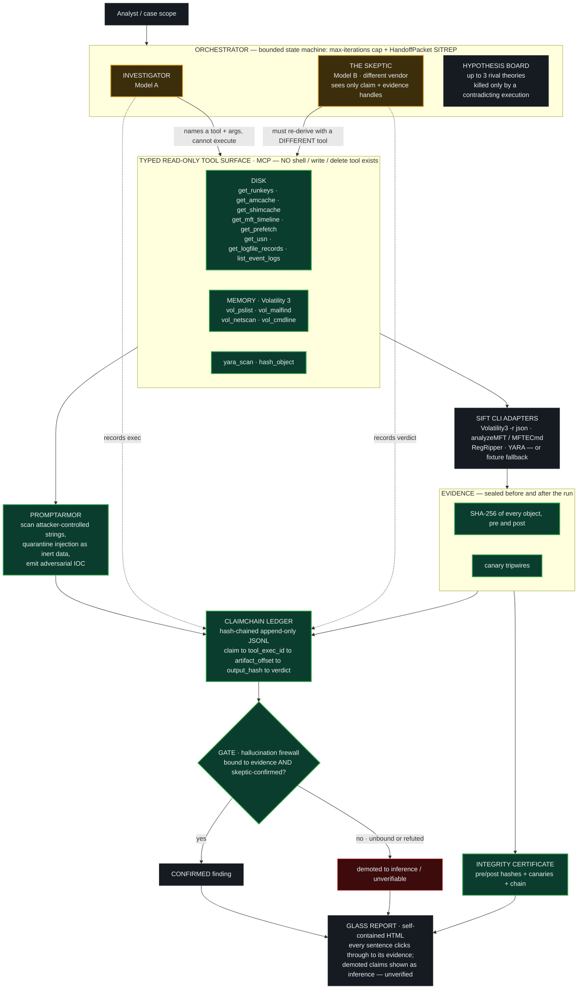

# Glass Box — Architecture & Trust Boundaries

**Architectural pattern:** *Custom MCP Server* (FIND EVIL! brief, Approach #2) —
the pattern the organizers call "the most sound architecture in the evaluation"
— combined with a *multi-agent* Investigator/Skeptic loop. The agent reaches
evidence **only** through typed, read-only forensic functions; there is no
generic `execute_shell` and no write/delete tool in existence.

> The two diagrams below render natively on GitHub (Mermaid). The first is the
> system / trust-boundary diagram required for submission; the second shows the
> self-correction loop.

---

## 1. System diagram (trust boundaries labeled)



**Legend**

| Style | Meaning |
|---|---|
| 🟩 green | **Architectural guardrail (HARD)** — holds even if the model misbehaves |
| 🟨 amber | **Prompt guardrail (SOFT)** — the model's instructions; *not relied upon* |
| 🟥 red | a claim the gate refused to confirm |

---

## 2. Where security boundaries are enforced

The brief requires architectural vs prompt guardrails to be distinguished. They are:

**Architectural guardrails (HARD — enforced by code/OS, survive a misbehaving model):**

| # | Guarantee | Enforced in | How to verify |
|---|---|---|---|
| A1 | No write/shell primitive exists in the tool surface | `tools.py`, `mcp_server.py` | `python -m glassbox.mcp_server --list` → `write_tools: []`, `shell_tools: []` |
| A2 | Evidence unchanged — SHA-256 sealed pre/post + canary tripwires | `evidence.py` | `out/integrity_certificate.json` (`overall_ok`) |
| A3 | Unbound or skeptic-refuted claims cannot be "confirmed" | `gate.py` | `tests/test_gate.py`; gate decisions in the ledger |
| A4 | Tamper-evident audit trail | `claimchain.py` | flip one byte → `verify_chain()` localizes the break |
| A5 | Skeptic must use a *different* tool than the Investigator | `agent.py`, `llm.py` | `tests/test_end_to_end.py` asserts disjoint tool sets |
| A6 | Evidence text is never executed as instruction | `promptarmor.py` | injection corpus self-test; quarantined as inert data |

**Prompt guardrail (SOFT — labeled as such, deliberately *not* trusted):**

- The Investigator's system prompt asks it to cite evidence and not over-flag.
  This is **not** the protection. The **gate (A3)** enforces citation
  structurally, so even if the prompt is ignored or the model hallucinates, an
  unbound claim can never reach the "confirmed" column. The prompt improves
  quality; the architecture provides the guarantee.

---

## 3. The self-correction loop (the autonomy tiebreaker)

```mermaid
sequenceDiagram
    participant I as Investigator · Model A
    participant T as Typed read-only tools
    participant L as ClaimChain ledger
    participant S as Skeptic · Model B, other vendor
    participant G as Gate

    I->>T: call get_* / vol_* (names tool; code executes it)
    T->>L: record ToolExecution (hash, offset, summary)
    I->>L: record Claim, citing tool_exec_id(s)
    Note over S: sees ONLY the claim text + which tools were used
    S->>T: re-derive with a DIFFERENT tool
    T->>L: record Skeptic ToolExecution
    S->>L: record Verdict (confirm / refute / unverifiable)
    L->>G: claim + binding + verdict
    alt bound AND skeptic-confirmed
        G-->>L: final = CONFIRMED
    else unbound OR refuted OR unverifiable
        G-->>L: demoted to inference / unverifiable
        Note over G: e.g. "PSEXESVC is malware" — Skeptic shows it is signed Sysinternals, REFUTE, hypothesis killed (live self-correction)
    end
```

---

## 4. Components

| Module | File | Responsibility |
|---|---|---|
| Schemas | `glassbox/schemas.py` | `ToolExecution`, `Claim`, `Hypothesis`, `Confidence`/`Verdict` enums (the frozen data contract) |
| Ledger | `glassbox/claimchain.py` | hash-chained append-only JSONL; `verify_chain`, `export_report_data` |
| Evidence | `glassbox/evidence.py` | seal/verify, canaries, self-signed integrity certificate |
| Tool surface | `glassbox/tools.py` | the 14 typed read-only tools; arg validation; provenance binding |
| SIFT adapters | `glassbox/sift_adapters.py` | drive live Volatility 3 / analyzeMFT / RegRipper / YARA; fixture fallback |
| MCP server | `glassbox/mcp_server.py` | expose the surface over MCP (`--list` proves 0 write/shell tools) |
| PromptArmor | `glassbox/promptarmor.py` | detect + quarantine injection in evidence; corpus self-test |
| Gate | `glassbox/gate.py` | the hallucination firewall (claim demotion) |
| Reasoners | `glassbox/llm.py` | Investigator/Skeptic; providers (Anthropic/OpenAI/Groq/Gemini/OpenRouter/Ollama) + deterministic engine |
| Agentic loop | `glassbox/agent.py` | real LLM drives the tools; independent Skeptic re-derives |
| Orchestrator | `glassbox/orchestrator.py` | the bounded state machine seal→…→report |
| Report | `glassbox/report.py` | self-contained click-through HTML |
| Scorer | `glassbox/scorer.py` | recall / precision / hallucinations vs ground truth |

---

## 5. Two run modes (same architecture)

| Mode | When | Reasoning | Accuracy on `case01` |
|---|---|---|---|
| **Deterministic engine** | default, no API keys | `glassbox/llm.py` fixed forensic logic | recall 1.0 / precision 1.0 / **0 hallucinations**, fully reproducible & offline |
| **Live agentic** | `.env` sets `GLASSBOX_INVESTIGATOR` + `GLASSBOX_SKEPTIC` | real different-vendor LLMs drive `glassbox/agent.py` | **0 hallucinations** in every run; recall scales with model quality / rate limits |

The gate, ledger, PromptArmor, sealing, and integrity certificate are **identical
in both modes** — only the reasoning changes. See `docs/ACCURACY.md` for the
measured numbers (run on the SIFT Workstation) and documented failure modes.

---

## 6. Invariant that ties it together

> **The model reasons; Glass Box owns the tools and the provenance.**

In both modes a model only ever *names* a tool and arguments. Glass Box executes
it, hashes the output, records the `tool_exec_id`, and binds the claim to it. A
model can never fabricate an execution, cite evidence it did not pull, or reach a
write/shell capability — because none exists to reach. That is why a Glass Box
finding is something you can put on a witness stand.
